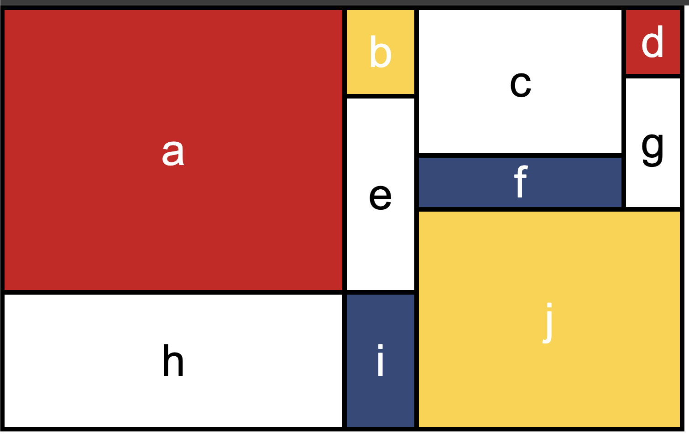

# CSS Grid Example

This project is a great example of CSS Grid Layout, inspired by Jen Kramer’s course on Frontend Master. It showcases how Grid can be effectively used to create responsive and visually appealing layouts in web design.

## Visual Design

Below are visual representations of the original design and my implementation:

### Jen Kramer's Webpage Example

### My Webpage

## Features

- Responsive design utilizing CSS Grid
- Clean and modern layout
- Comparison of original design and my final result

## Getting Started

To view the webpage locally, follow these steps:

1. Clone the repository or download the project files.
2. Open the `index.html` file in your web browser.
3. Explore the layout and design!

## Technologies Used

- HTML5
- CSS3 (Grid)

## Acknowledgments

- Special thanks to Jen Kramer for the insightful course that inspired this project.
